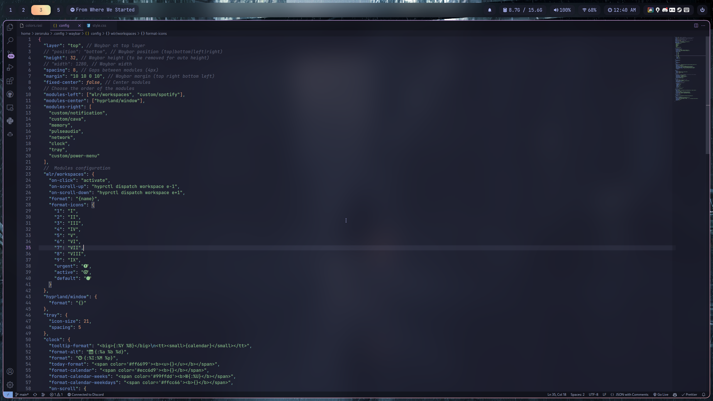

<div align="center">
    <h1>✨zeroruka's dot files✨</h1>
</div>




# Details

- **OS**: Arch Linux
- **Compositor**: [Hyprland](https://github.com/hyprwm/Hyprland)
- **Bar**: [Waybar](https://github.com/Alexays/Waybar)
- **Notifications**: [dunst](https://github.com/dunst-project/dunst)
- **Wallpaper Loader**: [swww](https://github.com/Horus645/swww)
- **Wallpaper**: `.config/wallpapers`
- **Terminal**: [kitty](https://github.com/kovidgoyal/kitty)
- **Shell**: [fish](https://fishshell.com/)
- **Prompt**: [starship](https://starship.rs/)
- **Launcher**: [rofi](https://github.com/davatorium/rofi)
- **Font**: [Nerd Font](https://www.nerdfonts.com/)

# Installation

## Dependencies

Install the following packages (Arch):

```
hyprland-git waybar-hyprland-git cava python kitty fish rofi xdg-desktop-portal-hyprland-git grim slurp starship jq dunst wl-clipboard swaylock-effects-git btop pavucontrol swww polkit-kde-agent nerd-fonts-jetbrains-mono playerctl socat hyperpicker-git
```

Next, follow the [Quick Start Instructions](https://wiki.hyprland.org/) from Hyprland wiki.

For Nvidia, replace `hyprland-git` with `hyprland-nvidia-git`, and follow the [Nvidia section](https://wiki.hyprland.org/Nvidia/) of the Hyprland wiki.

## Setup config files

Copy all files from `./config` in this repo to your config directory.

```bash
git clone https://github.com/zeroruka/dotfiles.git
cd dotfiles
cp -r ./config/* ~/.config
```

Edit hyprland config file accordingly to fit your screen resolution/monitor setup.

## Theming Other Applications

### Spotify (Spicetify)

Install Spicetify by following the [Spicetify wiki](https://spicetify.app/docs/getting-started/). Make sure that the marketplace is also installed.

Then, install the [Bloom](https://github.com/nimsandu/spicetify-bloom) theme using the marketplace, and apply the comfy varient of the theme.

### VS-code

Install the [Catppuccin for VSCode](https://github.com/catppuccin/vscode) extension, and then apply the Catppuccin Mocha theme.

### Cursor

Install [Catppuccin Cursors](https://github.com/catppuccin/cursors) by following the instructions in the README.

### GTK

Install the `catppuccin-gtk-theme-mocha` package from the AUR.
